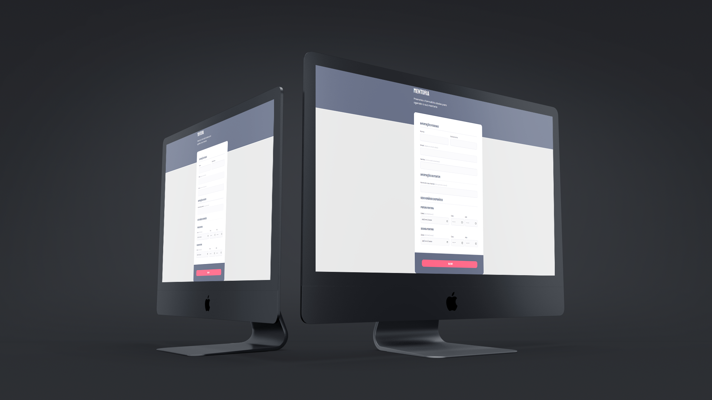

  
  

## 🖥️ Projeto

Esse é um projeto de formulário para agendamento de mentoria.

## 🚀 Tecnologias

Esse projeto foi desenvolvido durante o curso Explorer da Rocketseat com as seguintes tecnologias:

- HTML
- CSS
- Git e Github

## 💡 Conhecimentos Adquiridos

- Utilização de content no body::before, configurando position e z-index.
- Método POST no form.